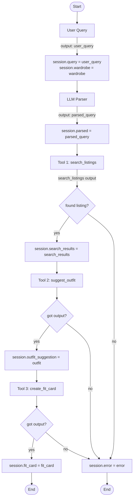

# FitFindr — planning.md

> Complete this document before writing any implementation code.
> Your spec and agent diagram are what you'll use to direct AI tools (Claude, Copilot, etc.) to generate your implementation — the more specific they are, the more useful the generated code will be.
> Your planning.md will be reviewed as part of your submission.
> Update it before starting any stretch features.

---

## Tools

List every tool your agent will use. For each tool, fill in all four fields.
You must have at least 3 tools. The three required tools are listed — add any additional tools below them.

### Tool 1: search_listings

**What it does:**
<!-- Describe what this tool does in 1–2 sentences -->
Given user input, this tool will do a keyword matching against all the listings in the database.
- Filters through price, if given.
- Filters through size, if given.
- Match the description to all the other attributes - style tag, description, color, etc.

**Input parameters:**
<!-- List each parameter, its type, and what it represents -->
- `description` (str): The description of the 
- `size` (str): optional; the size of the garment/shoe that the user wants
- `max_price` (float): option; the max price that user wants to spend on the new item.

**What it returns:**
<!-- Describe the return value — what fields does a result contain? -->
- A list of matching listings sorted by relevance (most matched first)
- An empty list if there is no match

**What happens if it fails or returns nothing:**
<!-- What should the agent do if no listings match? -->
- When suggest_listinghs loop returns nothing, the agent stops and sends a message to the user stating 'No matches found. Please try again with a broder category, size or prices'.

---

### Tool 2: suggest_outfit

**What it does:**
<!-- Describe what this tool does in 1–2 sentences -->
Given the new listing matched with user's preference and user's wardrobe, `suggest_outfit` tries to match new listing with items in the wardrobe to create an outfit suggestion.

**Input parameters:**
<!-- List each parameter, its type, and what it represents -->
- `new_item` (dict): The top matched listing from `search_listings` that matches user's preference.
- `wardrobe` (dict): A wardrobe dict with an 'items' key containing a list of wardrobe item dicts. May be empty. When wardrobe is empty, the tool is supposed to provide a general styling advice.

**What it returns:**
<!-- Describe the return value -->
- A non-empty string with outfit suggestions.

**What happens if it fails or returns nothing:**
<!-- What should the agent do if the wardrobe is empty or no outfit can be suggested? -->
- The tool `suggest_output`is desgined to not fail on an empty wardrobe. When the wardrobe is empty, the LLM is required to offer a general advice.
- In case of an LLM error, send a friendly message to the user stating "couldn't generate at the moment. Please try again later" and skip caption creation step.

---

### Tool 3: create_fit_card

**What it does:**
<!-- Describe what this tool does in 1–2 sentences -->
Generates Instagram/Tiktok ready to share caption for suggested outfit.

**Input parameters:**
<!-- List each parameter, its type, and what it represents -->
- `outfit` (str): The outfit suggestion created by the tool `suggest_outfit`
- `new_item` (dict): The top matched list from `search_listings` that matches user's preference.

**What it returns:**
<!-- Describe the return value -->
- A string output of 2-4 sentences that is a redy-to-use Instagram/Tiktok caption

**What happens if it fails or returns nothing:**
<!-- What should the agent do if the outfit data is incomplete? -->
- The tool we provide agent with a friendly message such as: "Couldn't generate a fit card — no outfit suggestion was provided."

---

### Additional Tools (if any)

<!-- Copy the block above for any tools beyond the required three -->

---

## Planning Loop

**How does your agent decide which tool to call next?**
<!-- Describe the logic your planning loop uses. What does it look at? What conditions change its behavior? How does it know when it's done? -->
#### *The application starts when user enters input and LLM parses it. After this, the planning loop of the agent begins. The following steps will happen in the planning loop.*
1. Tool `search_listings` is called with the parsed user input.
     - If the tool runs successfully and is able to find a match, the result is stored in *session.search_results* and next tool is called.
     - If there is an error, the agent stops the loops and provides message to the user to try again.
2. If the tool `suggest_outfit` is called with the new_item as well as user's wardrobe.
     - If the wardrobe is empty, then the tool is supposed to provide a general styling advice, otherwise it matches the new_item with the wardrobe to suggest the outfit.
     - If the LLM fails, then that means the tool call has failed and we stop the loop. Otherwise the next tool is called.
3. Now the tool `create_fit_card` is called with new_item as well as outfit. 
     - If there is not outfit, send user friendly message that outfit is empty.
     - With all the valid inputs, the tool provides a caption which can be used on instagram or tiktok.

---

## State Management

**How does information from one tool get passed to the next?**
<!-- Describe how your agent stores and accesses state within a session. What data is tracked? How is it passed between tool calls? -->
- All state for a single interaction is stored in a session dict, created fresh by `_new_session()` at the start of every query. Each tool reads from earlier fields and writes to its own field. If any step fails, `error` is set and the remaining fields stay `None`.

- **Session fields and data flow:**

| Field | Set by | Read by | Initial value |
|-------|--------|---------|---------------|
| `query` | `_new_session()` | Query parser | User's raw input string |
| `parsed` | Query parser (Step 2) | `search_listings` | `{}` |
| `search_results` | `search_listings` (Step 3) | Item selection (Step 4) | `[]` |
| `selected_item` | Step 4 (`results[0]`) | `suggest_outfit`, `create_fit_card` | `None` |
| `wardrobe` | `_new_session()` | `suggest_outfit` | Passed in from UI |
| `outfit_suggestion` | `suggest_outfit` (Step 5) | `create_fit_card` | `None` |
| `fit_card` | `create_fit_card` (Step 6) | Final output to user | `None` |
| `error` | Any step that fails | `handle_query()` in app.py | `None` |

- The session dict is the **single source of truth**. No data is passed between tools directly — every tool writes to the session, and the next tool reads from it.
     

---

## Error Handling

For each tool, describe the specific failure mode you're handling and what the agent does in response.

| Tool | Failure mode | Agent response |
|------|-------------|----------------|
| search_listings | No results match the query | Set `session["error"]` to "No listings matched your search. Try broader keywords, a different size, or a higher price." and return the session early. Tools 2 and 3 are **not called**. |
| suggest_outfit | Wardrobe is empty | Not a failure — the tool handles this internally by asking the LLM for general styling advice instead of wardrobe-specific outfits. The loop continues normally. |
| suggest_outfit | Groq API call fails (timeout, rate limit, bad key) | The tool catches the exception internally and returns a friendly message string: "Couldn't generate outfit suggestions right now. Please try again later." No exception is raised to the agent. |
| create_fit_card | Outfit input is empty or whitespace | The tool returns a descriptive error message string: "Couldn't generate a fit card — no outfit suggestion was provided." No exception is raised. |
| create_fit_card | Groq API call fails (timeout, rate limit, bad key) | The tool catches the exception internally and returns a friendly message string: "Couldn't generate a fit card right now. Please try again later." No exception is raised to the agent. |

---

## Architecture

*See also: `assets/architecture.excalidraw` for visual version of this diagram.*

---

## AI Tool Plan

<!-- For each part of the implementation below, describe:
     - Which AI tool you plan to use (Claude, Copilot, ChatGPT, etc.)
     - What you'll give it as input (which sections of this planning.md, your agent diagram)
     - What you expect it to produce
     - How you'll verify the output matches your spec before moving on

     "I'll use AI to help me code" is not a plan.
     "I'll give Claude my Tool 1 spec (inputs, return value, failure mode) and ask it to implement
     search_listings() using load_listings() from the data loader — then test it against 3 queries
     before trusting it" is a plan. -->

**Milestone 3 — Individual tool implementations:**

- **Tool 1 (`search_listings`):** I'll give Claude Code the Tool 1 spec from this planning.md (inputs, return value, failure mode) and ask it to implement `search_listings()` in `tools.py` using `load_listings()` from `utils/data_loader.py`. Before trusting it, I'll verify:
  - It filters by `max_price` and `size` when provided
  - It scores listings by keyword overlap with `description` against fields like `title`, `description`, `style_tags`, `colors`
  - It drops zero-score results and sorts by score descending
  - It returns `[]` for impossible queries (e.g., "designer ballgown", size="XXS", max_price=5)
  - I'll test with 3 queries: a happy-path match, a no-results query, and a price-only filter

- **Tool 2 (`suggest_outfit`):** I'll give Claude Code the Tool 2 spec and ask it to implement `suggest_outfit()` using the Groq client (`llama-3.3-70b-versatile`). Before trusting it, I'll verify:
  - It checks if `wardrobe["items"]` is empty and switches to a general-advice prompt
  - It wraps the Groq API call in a try/except and returns a friendly error string on failure
  - I'll test with both `get_example_wardrobe()` and `get_empty_wardrobe()` to confirm both paths work

- **Tool 3 (`create_fit_card`):** I'll give Claude Code the Tool 3 spec and ask it to implement `create_fit_card()` using the Groq client with a higher temperature for variety. Before trusting it, I'll verify:
  - It guards against an empty/whitespace `outfit` string and returns an error message
  - It wraps the Groq API call in a try/except
  - I'll run it twice on the same input to confirm outputs vary (not identical)

**Milestone 4 — Planning loop and state management:**

- I'll give Claude Code the Planning Loop section, State Management table, Error Handling table, and the Architecture diagram from this planning.md, and ask it to implement `run_agent()` in `agent.py`. Before trusting it, I'll verify:
  - It creates a fresh session with `_new_session()`
  - It parses the query to extract `description`, `size`, and `max_price`
  - It branches on empty `search_results` — sets `session["error"]` and returns early without calling tools 2 and 3
  - It stores each tool's output in the correct session field
  - I'll test with the happy-path query from the Complete Interaction section and the no-results query ("designer ballgown size XXS under $5") to confirm both paths work

- For `handle_query()` in `app.py`, I'll ask Claude Code to wire it up using the session dict. I'll verify it maps `session["error"]` to panel 1 with empty panels 2 and 3, and on success maps `selected_item`, `outfit_suggestion`, and `fit_card` to the three panels.

---

## A Complete Interaction (Step by Step)

Write out what a full user interaction looks like from start to finish — tool call by tool call. Use a specific example query.

**Example user query:** "I'm looking for a vintage graphic tee under $30. I mostly wear baggy jeans and chunky sneakers. What's out there and how would I style it?"

**Step 1:**
<!-- What does the agent do first? Which tool is called? With what input? -->
- User input is first parsed to extract the useful information - such as description, size, and max price.
- Then agent calls the tool `search_listings`, to get matching data. Input to the tool is: description (required), size (optional) and max_price (optional).
- Out of everything matched, the top listing is selected.

**Step 2:**
<!-- What happens next? What was returned from step 1? What tool is called now? -->
- Once we get a valid non-empty result from `search_listings`, the agent calls `suggest_outfit` tool is called. Input to this tool is: result of tool1 + user's wardrobe.
- In this tool, we use LLM to suggest an outfit out of the given user's wardrobe that goes with the result of tool1.
- The output of this tool is going to be a style advice.

**Step 3:**
<!-- Continue until the full interaction is complete -->
- Once we receive an non-empty output from `suggest_outfit`, the tool `create_fit_card` is called. Input to this tool is the result of tool1 and tool2.
- The output is an Instagram/Tiktok caption for the output.

**Final output to user:**
<!-- What does the user actually see at the end? -->
- The user on the screen sees the top matchinbg listing from `search_listings`, outfit idea from `suggest_outfit` and the instagram caption from the last tool `create_fit_card`.
